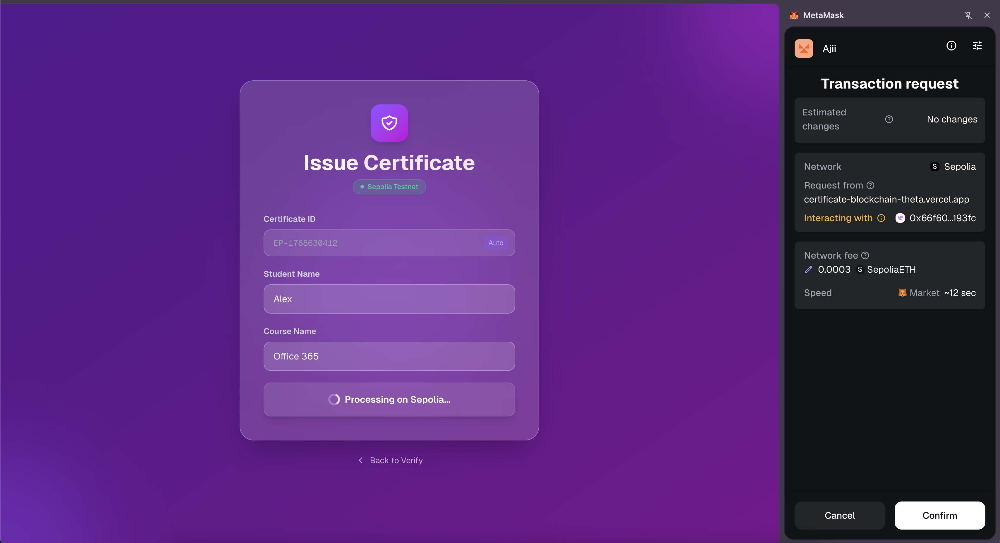
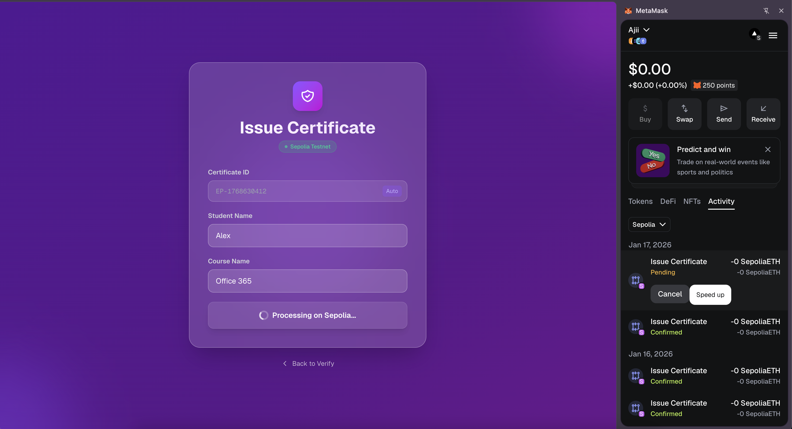
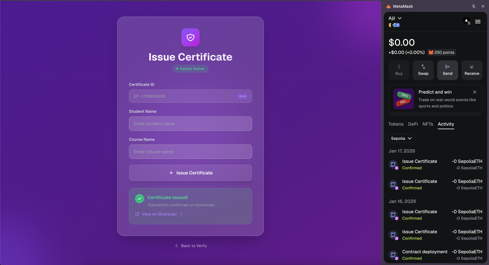
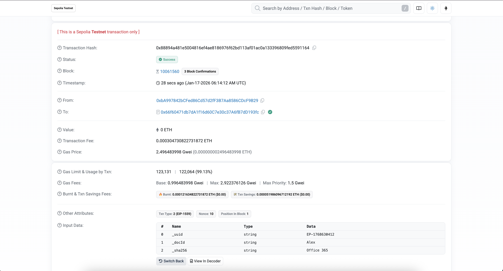
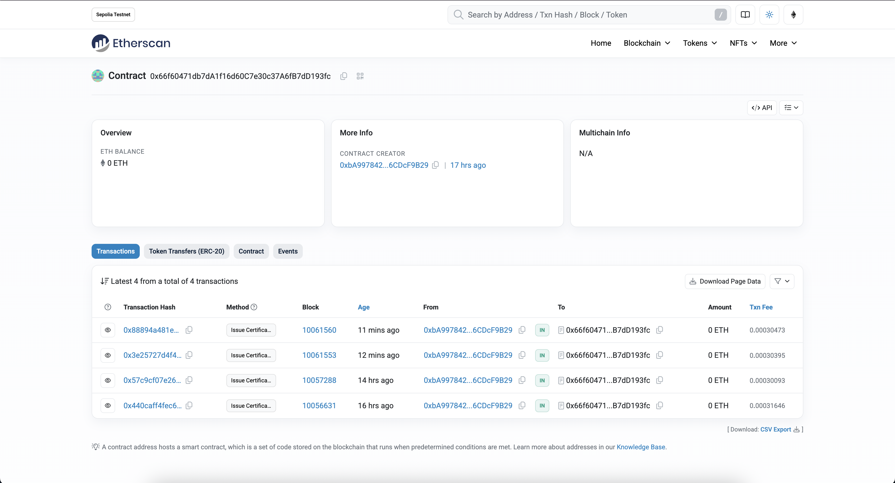
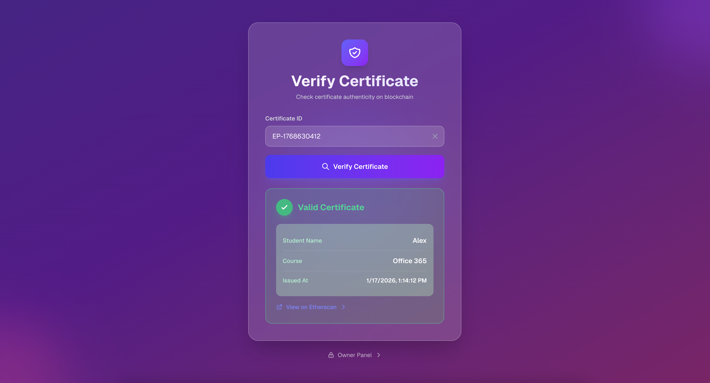

# Certificate Blockchain Application - Workflow Example

This document describes the end-to-end workflow of the certificate submission and verification system on the Sepolia testnet.

## Workflow Overview

### 1. Submit Certificate

- User fills out the certificate submission form
- Requires MetaMask confirmation for transaction signing
- Transaction details displayed before signing

### 2. Pending Transaction

- Transaction status shows "Pending" during blockchain processing
- Waiting for block confirmation
- Do not close the window during this process

### 3. Transaction Success

- Transaction successfully completed on the blockchain
- Transaction hash displayed with a link to view details
- Certificate ID generated and shown

### 4. View on Etherscan

- Click the transaction hash link to open https://sepolia.etherscan.io/address
- View complete transaction details including:
  - Transaction hash
  - Block number
  - Gas used
  - From/To addresses
  - Contract interaction details

### 5. Transaction History

- View list of all transactions for the contract address
- Filterable transaction history
- Certificate records with their blockchain references

### 6. Certificate Verification

- Dedicated verification page
- Enter Certificate ID to verify authenticity
- Displays certificate details and blockchain proof
- Links to original transaction on Etherscan

## Technical Details

- **Network**: Sepolia Testnet
- **Blockchain Explorer**: https://sepolia.etherscan.io
- **Transaction Type**: Smart Contract Interaction
- **Gas**: Estimated and paid by the submitter

## Important Notes

- Ensure MetaMask is connected to Sepolia testnet
- Have testnet ETH for gas fees
- Keep your Certificate ID secure for verification
- All data is immutable once recorded on blockchain
